# AI 기반 뉴스 수집 및 가짜뉴스 판별 앱

Kotlin과 Jetpack Compose로 개발한 Android 네이티브 뉴스 탐색 및 팩트체크 앱입니다. 연합뉴스, MBC, SBS, KBS, YTN 기사를 한 화면에서 확인하고 키워드로 관련 기사를 검색할 수 있으며, 사용자가 입력한 주장을 Gemini와 Google Search Grounding으로 분석해 판정 요약과 근거 출처를 제공합니다.

> Gemini 판정은 사실 확인을 돕는 참고 정보입니다. 최종 판단에는 공식 자료와 복수의 신뢰 가능한 출처를 함께 확인해야 합니다.

## 핵심 기능

- 연합뉴스, MBC, SBS, KBS, YTN 기사 통합 수집
- 언론사별 병렬 수집과 완료 결과의 점진적 화면 표시
- 공식 RSS, 제한적 HTML Crawling, Google News RSS를 조합한 fallback 처리
- 전체 또는 개별 언론사 선택과 언론사별 수집 진행·실패 상태 표시
- 복수 키워드 등록·삭제와 `SEARCH` 전용 기사 수집
- 검색 카드의 대표 이미지, 본문 미리보기, 일치 키워드 chip 표시
- 언론사별 최대 5건 제한, URL 정규화, 기사 검증, 중복 제거, 최신순 정렬
- 기사 상세 화면과 외부 브라우저 원문 열기
- Gemini 2.5 Flash와 Google Search Grounding 기반 주장 판별
- 판정 신뢰도, 판단 요약, 근거, 검색어, 참고 출처 제공

## 주요 실행 화면

### 메인 뉴스 화면

선택한 5개 언론사의 최신 기사를 카드로 표시합니다. 언론사별 수집을 병렬로 진행하고, 먼저 완료된 결과부터 화면에 반영합니다.

<table>
  <tr>
    <td align="center">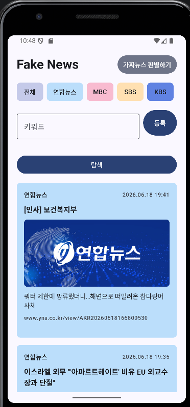</td>
    <td align="center">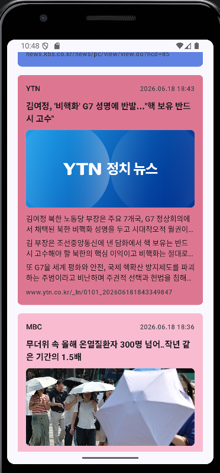</td>
  </tr>
  <tr>
    <td align="center"><b>언론사 선택과 뉴스 탐색</b></td>
    <td align="center"><b>언론사별 기사 카드</b></td>
  </tr>
</table>

언론사 색상을 선택 버튼과 기사 카드에 일관되게 적용하고, 이미지와 본문 미리보기가 있는 경우 카드에서 함께 확인할 수 있습니다.

### 기사 상세 화면

기사 카드를 선택하면 제목, 언론사, 발행 시각, 이미지와 본문을 앱 내부에서 확인할 수 있습니다. `원본 보러가기`를 누르면 시스템 브라우저에서 언론사 원문을 엽니다.

<table>
  <tr>
    <td align="center">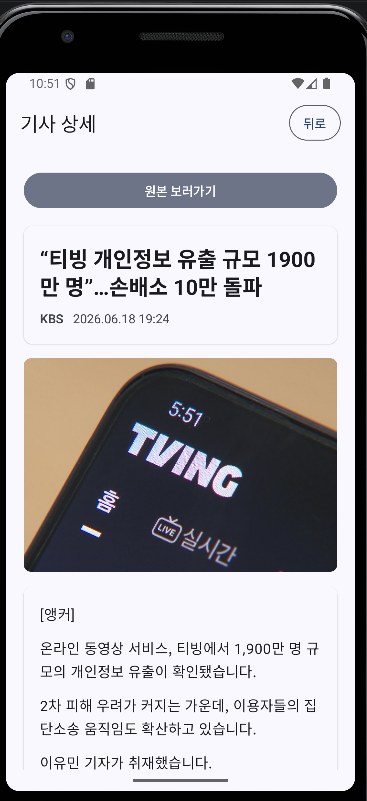</td>
    <td align="center">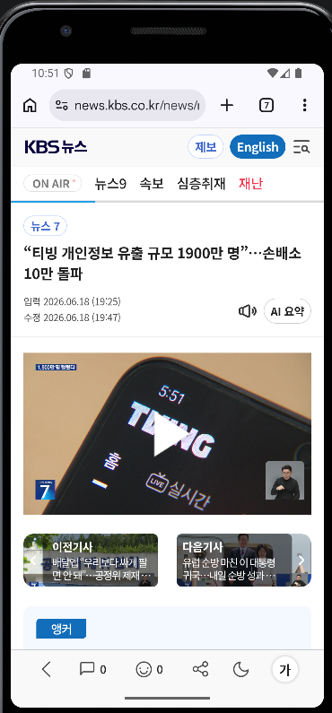</td>
  </tr>
  <tr>
    <td align="center"><b>앱 내부 기사 상세</b></td>
    <td align="center"><b>외부 브라우저 원문</b></td>
  </tr>
</table>

원문 상세 요청에 실패하더라도 수집된 제목과 요약을 유지하며, 유효한 원문 URL이 있을 때 외부 브라우저 이동을 제공합니다.

### 키워드 검색 화면

여러 키워드를 등록하고 선택한 언론사를 대상으로 관련 기사를 검색합니다. 검색 결과에는 기사와 일치한 키워드, 가능한 경우 대표 이미지와 본문 미리보기를 표시합니다.

<table>
  <tr>
    <td align="center">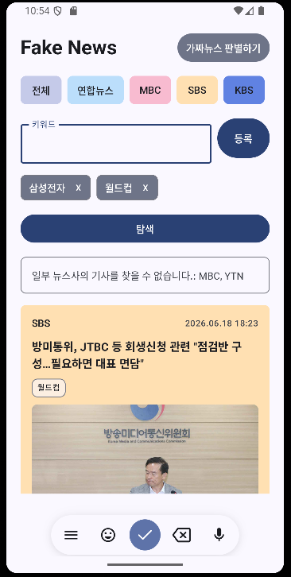</td>
    <td align="center">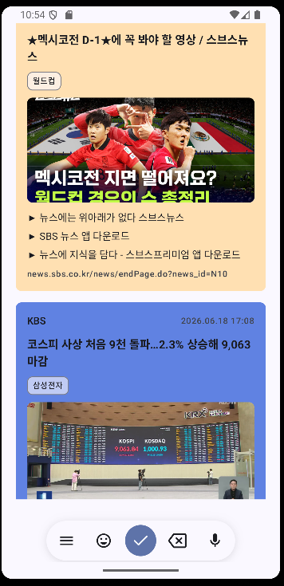</td>
  </tr>
  <tr>
    <td align="center"><b>복수 키워드 등록</b></td>
    <td align="center"><b>일치 키워드가 표시된 결과</b></td>
  </tr>
</table>

키워드 검색은 메인 목록을 단순 필터링하지 않고 별도의 `SEARCH` 경로를 사용하므로, 메인에 노출되지 않은 관련 기사도 검색 후보에 포함할 수 있습니다.

### 가짜뉴스 판별 입력 및 분석 결과

의심되는 문장이나 기사 내용을 입력하면 Gemini가 판정, 신뢰도와 판단 요약을 구조화해 반환합니다. 입력한 주장에 필요한 시점이나 맥락이 부족하면 확정 판정 대신 추가 정보가 필요하다는 결과를 표시할 수 있습니다.

<table>
  <tr>
    <td align="center">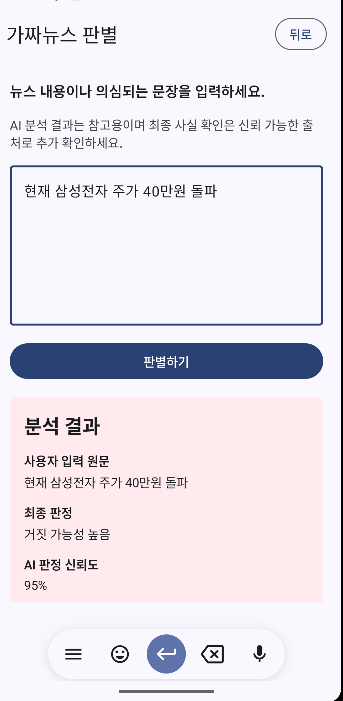</td>
    <td align="center">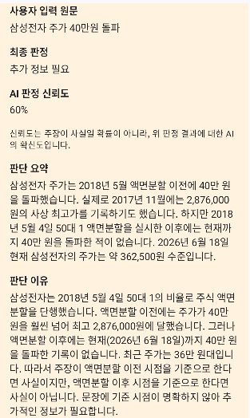</td>
  </tr>
  <tr>
    <td align="center"><b>주장 입력과 판별 요청</b></td>
    <td align="center"><b>판정 요약과 판단 이유</b></td>
  </tr>
</table>

검색이 수행된 경우 Grounding metadata에서 사용된 검색어와 참고 출처를 추출합니다. 모델 응답과 근거의 관련성, 최신 정보 필요 여부를 후처리해 최종 신뢰도를 조정합니다.

<table>
  <tr>
    <td align="center">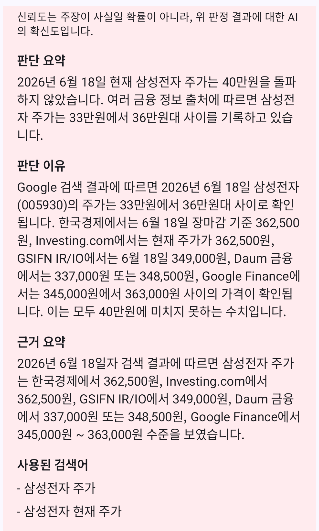</td>
    <td align="center">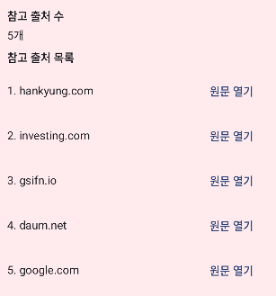</td>
  </tr>
  <tr>
    <td align="center"><b>근거 요약과 검색어</b></td>
    <td align="center"><b>Grounding 참고 출처</b></td>
  </tr>
</table>

## 기술 스택

| 구분 | 기술 |
| --- | --- |
| Language | Kotlin 2.0.21, JDK 17 |
| UI | Jetpack Compose, Material 3 |
| Architecture | MVVM, Repository Pattern, 일부 UseCase |
| State / Async | ViewModel, StateFlow, Coroutines, Flow |
| Navigation | Navigation Compose |
| Network | Retrofit 2.11, OkHttp 4.12 |
| Parsing | Jsoup, kotlinx.serialization, XML parser |
| Image | Coil Compose |
| AI | Gemini API, Google Search Grounding |
| Build | Gradle 8.10.2, Android Gradle Plugin 8.7.3 |
| Android | minSdk 26, compileSdk 35, targetSdk 35 |
| Test | JUnit 4, kotlinx-coroutines-test |

## 시스템 구조

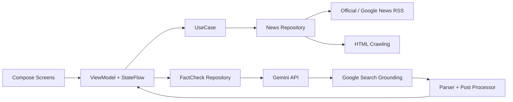

- UI는 Compose Screen과 재사용 가능한 Component로 구성합니다.
- ViewModel은 `StateFlow`를 통해 로딩, 부분 성공, 빈 결과와 오류 상태를 관리합니다.
- Repository는 언론사별 데이터 소스 순서, timeout, fallback과 결과 통합을 담당합니다.
- 파서와 검증 유틸리티는 URL 정규화, 기사 품질 검증, 중복 제거와 AI 응답 후처리를 담당합니다.

## 프로젝트 구조

```text
app/src/main/java/com/example/fakenews/
├── data/
│   ├── model/        # 기사, 출처 상태, Gemini 판정 모델
│   ├── remote/       # RSS/HTML/Gemini 통신 및 파싱
│   └── repository/   # 수집 순서, fallback, 결과 통합
├── domain/usecase/   # 뉴스 조회 UseCase
├── ui/
│   ├── main/         # 메인 뉴스와 키워드 검색
│   ├── detail/       # 기사 상세
│   ├── factcheck/    # Gemini 판별
│   ├── components/   # 공통 Compose 컴포넌트
│   └── navigation/   # 화면 이동
└── util/             # 필터, 검증, 정규화, Gemini 후처리

docs/images/           # GitHub README 실행 화면
tools/raw-news-inspector/
                        # 앱과 분리된 원본 응답 점검 도구
```

## 뉴스 수집 방식

`MAIN_DEFAULT`는 선택한 언론사를 병렬로 수집하고 각 언론사 안에서는 데이터 소스를 순차적으로 확인합니다.

```text
언론사 선택
    ↓
언론사별 병렬 수집
    ↓
Official RSS → 제한적 HTML Crawling → Google News RSS 후보
    ↓
원문 URL·도메인·제목·본문 품질 검증
    ↓
URL 정규화·중복 제거·언론사별 최대 5건 제한
    ↓
완료된 언론사 결과부터 Flow로 화면에 전달
```

- 소스에서 충분한 기사를 얻지 못하면 다음 수집 후보를 확인합니다.
- 한 언론사가 실패해도 다른 언론사의 성공 결과는 유지하고 부분 실패 상태를 표시합니다.
- 실제 앱 경로에서는 테스트용 mock 기사로 fallback하지 않습니다.
- KBS는 공식 RSS, HTML, KBS 도메인으로 제한한 Google News RSS 후보를 사용합니다.

## 키워드 검색 방식

키워드가 등록되면 메인 기사에 대한 로컬 필터가 아니라 별도의 `SEARCH` 수집을 실행합니다.

```text
복수 키워드 정규화
    ↓
Google News RSS 검색 쿼리 변형 생성
    ↓
Google News 링크의 언론사 원문 URL 해석·검증
    ↓
필요 시 언론사 RSS와 HTML 수집 경로 확인
    ↓
이미지·본문 preview 보강과 matchedKeywords 계산
    ↓
중복 제거 후 언론사별 최대 5건 표시
```

키워드 기반 검색 결과를 수집하고, Google News RSS 원문 해석이 실패할 경우 언론사 RSS 및 HTML 수집 경로로 전환합니다. 원문 URL 해석은 외부 응답 정책과 네트워크 상태에 따라 실패할 수 있으며 항상 성공한다고 가정하지 않습니다.

요청 버전 관리, 중복 요청 방지와 전체·소스별 timeout을 적용해 이전 검색 결과가 최신 상태를 덮어쓰거나 빈 결과에서 무한 로딩이 지속되지 않도록 처리합니다.

## Gemini Google Search Grounding 기반 판별 흐름

```text
사용자 주장 원문 입력
    ↓
팩트체커 프롬프트 + google_search 도구 요청
    ↓
Gemini 2.5 Flash, 필요 시 Flash Lite fallback
    ↓
구조화된 JSON 응답과 Grounding metadata 파싱
    ↓
출처 수·고유 URL·검색어·근거 직접성 평가
    ↓
시간 민감도·누락 맥락을 반영한 판정과 신뢰도 후처리
    ↓
요약·근거·검색어·참고 출처 표시
```

- 보편적 과학·역사·일반 지식은 검색 없이 내부 지식으로 판단할 수 있습니다.
- 주가, 스포츠, 선거, 최근 사건처럼 최신성이 중요한 주장은 검색 근거와 기준 시점을 우선합니다.
- 근거가 부족하거나 시점·대상이 모호하면 `UNVERIFIABLE` 또는 `NEEDS_MORE_CONTEXT`를 사용합니다.
- 신뢰도는 주장이 사실일 확률이 아니라, 최종 verdict에 대한 AI 판단의 확신 정도를 나타내는 `0~100` 점수입니다.
- 앱은 모델 점수를 그대로 표시하지 않고 Grounding 근거 수, 고유 URL, 근거 직접성, 시간 민감도와 누락 맥락을 반영해 보정합니다.

## 주요 문제 해결 경험

### 서로 다른 뉴스 소스 통합

- 언론사마다 다른 RSS와 HTML 구조를 공통 `NewsArticle` 모델과 Repository 흐름으로 통합했습니다.
- 언론사별 병렬 처리와 점진적 화면 업데이트로 모든 소스를 기다리지 않고 완료된 결과부터 표시했습니다.
- timeout과 부분 실패를 분리해 특정 언론사 오류가 전체 수집 실패로 이어지지 않게 했습니다.

### KBS 기사 수집 안정화

- KBS 공식 RSS를 수집 후보에 포함하고 HTTP 접근 허용 범위를 KBS 뉴스 도메인으로 제한했습니다.
- 공식 RSS, HTML, KBS 전용 Google News RSS 후보를 함께 사용해 단일 소스 실패에 대응했습니다.
- PC·모바일 원문 URL과 기사 ID를 정규화하고, 해석한 URL을 도메인 및 기사 URL 정책으로 다시 검증했습니다.

### 메인 수집과 검색 경로 분리

- 메인 기사만 필터링해서 희귀 키워드를 찾지 못하던 문제를 `MAIN_DEFAULT`와 `SEARCH` 모드 분리로 해결했습니다.
- 검색 쿼리 결과에 원문 이미지, 본문 미리보기와 일치 키워드를 연결했습니다.
- 요청 버전과 timeout을 관리해 느린 응답에 의한 화면 상태 오염과 무한 로딩을 방지했습니다.

### AI 판정 신뢰성 보완

- Google Search Grounding 출처와 모델 설명을 분리해 파싱했습니다.
- 검색 근거가 없는 최신 주장과 날짜가 빠진 금융·스포츠·선거 주장을 확정적으로 표시하지 않도록 후처리했습니다.
- 신뢰도 형식 오류와 verdict-신뢰도 불일치를 정규화하고 단위 테스트로 검증했습니다.

## 설치 및 실행 방법

필수 환경:

- Android Studio 또는 JDK 17
- Android SDK 35
- Android 8.0(API 26) 이상의 에뮬레이터 또는 기기

1. 저장소를 clone하고 Android Studio에서 프로젝트 루트를 엽니다.
2. SDK Manager에서 Android SDK 35가 설치되어 있는지 확인합니다.
3. Android Studio가 생성하는 로컬 `local.properties`를 확인합니다.
4. Gemini 기능을 사용할 경우에만 아래 방법으로 API 키를 추가합니다.
5. Gradle Sync 후 에뮬레이터 또는 실제 기기에서 `app` 구성을 실행합니다.

PowerShell에서 빌드와 설치를 직접 실행할 수도 있습니다.

```powershell
.\gradlew.bat assembleDebug
& "$env:LOCALAPPDATA\Android\Sdk\platform-tools\adb.exe" install -r .\app\build\outputs\apk\debug\app-debug.apk
```

## API 키 설정 방법

`local.properties.example`을 참고해 프로젝트 루트의 `local.properties`에 아래 항목을 추가합니다.

```properties
GEMINI_API_KEY=YOUR_GEMINI_API_KEY_HERE
```

- 실제 API 키는 README, 이슈, 커밋에 기록하지 않습니다.
- `local.properties`와 서명 파일은 `.gitignore`로 제외됩니다.
- 키가 없으면 뉴스 기능은 사용할 수 있지만 Gemini 판별은 키 누락 안내를 표시합니다.
- Android 클라이언트에 포함된 키는 추출될 수 있으므로 실제 배포에서는 서버 프록시와 키 제한 정책이 필요합니다.

## 테스트 방법

```powershell
.\gradlew.bat test
.\gradlew.bat lintDebug
.\gradlew.bat assembleDebug
```

최근 로컬 자동 검증 결과:

| 항목 | 결과 |
| --- | --- |
| Unit test | 성공, debug/release 합계 776 test executions, 실패 0 |
| Android lint | 성공, 오류 0 |
| Debug APK build | 성공 |
| Device smoke test | 연결된 ADB 기기가 없어 미실행 |

자동 테스트 통과는 실제 외부 뉴스 사이트와 Gemini API의 네트워크 동작을 보장하지 않습니다. 공개 전 아래 항목을 에뮬레이터 또는 실제 기기에서 별도로 확인해야 합니다.

- [ ] 메인에서 연합뉴스, MBC, SBS, KBS, YTN 기사 표시
- [ ] KBS 단독 선택과 기사 상세·원본 링크 동작
- [ ] `AI` 또는 `삼성전자` 검색 카드의 이미지·본문 preview·matched keyword chip 표시
- [ ] `rarekeyword123` 검색 후 무한 로딩 없이 빈 결과 종료
- [ ] Gemini 판별 1회와 Grounding 근거·출처 표시

## 공개 저장소 파일 정책

포함 대상:

- `app/src/main`, `app/src/test`
- Gradle 설정과 Wrapper
- `README.md`, `.gitignore`, `local.properties.example`
- `docs/images` 실행 화면
- `tools/raw-news-inspector`와 재현 가능한 소형 sample report

제외 대상:

- `local.properties`, `.env*`, 실제 API 키
- `*.jks`, `*.keystore`, `key.properties` 등 서명 자료
- `.gradle`, `.idea`, `.kotlin`, 모든 `build` 폴더
- APK, AAB, 생성 로그, 원문 응답 파일, UI dump
- `tools.zip`, 내부 작업 인수인계 문서

## 알려진 한계

- 뉴스 수집은 외부 RSS 주소, HTML 구조, 접근 정책과 네트워크 상태에 영향을 받습니다.
- Google News RSS 원문 URL 해석은 항상 성공하지 않으며, 실패 시 언론사 RSS와 HTML 수집 경로를 확인합니다.
- HTML Crawling은 각 사이트의 이용 약관과 robots.txt를 확인한 범위에서 사용해야 합니다.
- 일부 RSS는 본문 전체나 이미지 URL을 제공하지 않아 카드 정보가 제한될 수 있습니다.
- Gemini 판정은 오답이나 누락된 근거를 포함할 수 있으며 최종 사실 판단을 대신하지 않습니다.
- 앱에 직접 포함한 API 키는 완전히 보호할 수 없습니다.
- 자동화된 Compose UI/instrumentation test가 없어 화면과 실제 네트워크 동작은 기기 smoke test가 필요합니다.
- 의존성 주입은 Hilt가 아닌 간단한 `AppContainer` 기반입니다.

## 향후 개선 방향

- API 키 보호와 사용량 제어를 위한 서버 프록시
- Room 기반 기사 캐시와 오프라인 조회
- Hilt 기반 의존성 주입
- Compose UI 및 instrumentation test
- RSS/HTML 파서 상태 모니터링과 회귀 테스트 자동화
- 접근성, 앱 아이콘, 배포용 서명과 스토어 메타데이터 정리
